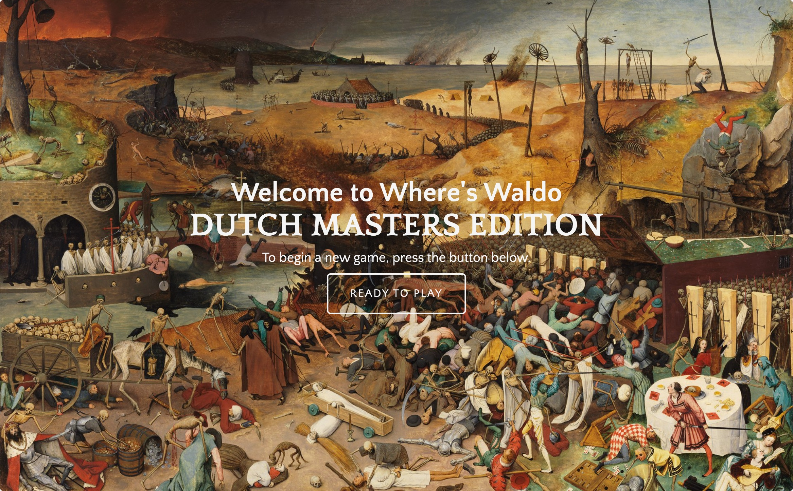
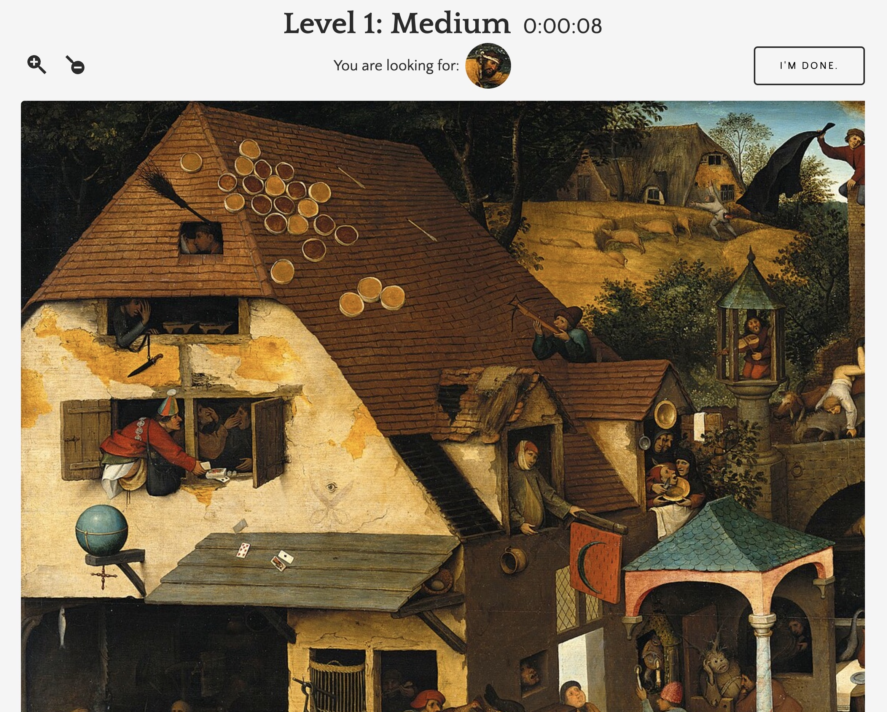
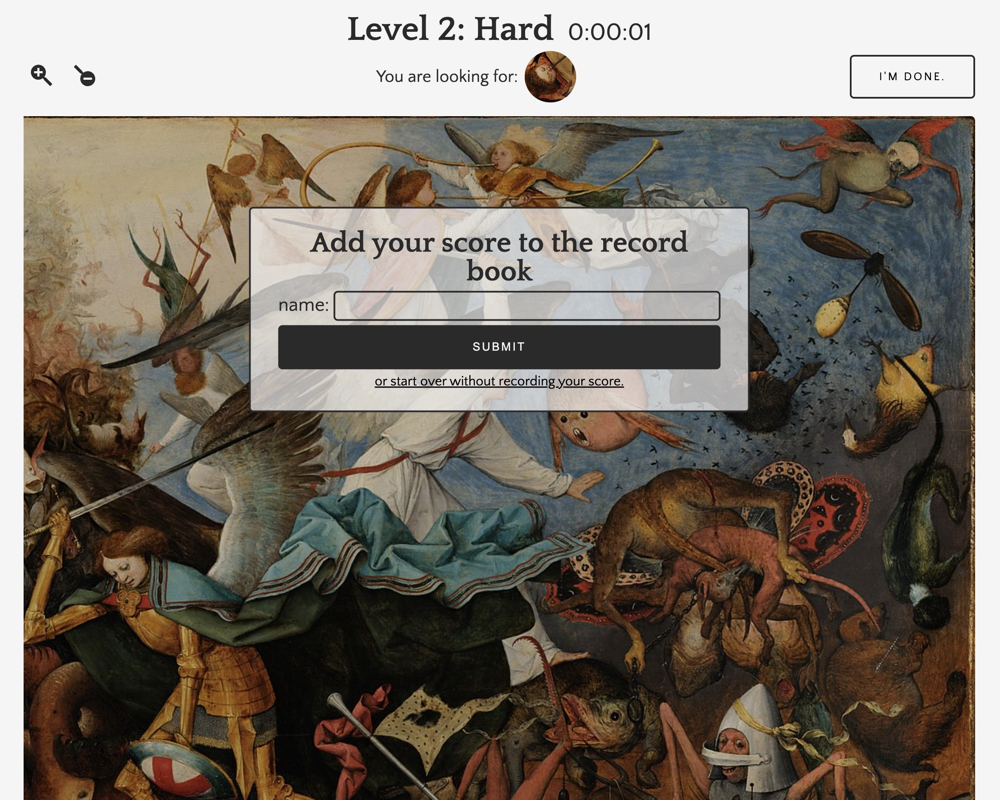
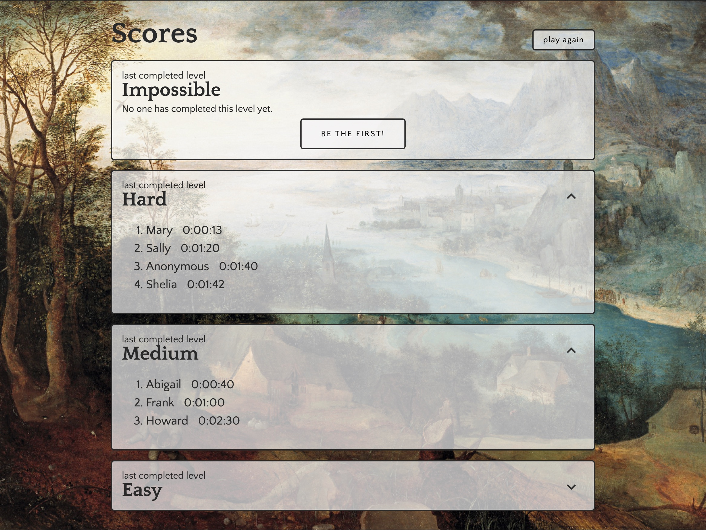

# Where's Waldo - Dutch Masters Edition

An implementation of a Where's Waldo style game, built as part of the [Odin Project](https://www.theodinproject.com). 

## Features

- A React frontend and Rails backend
- 4 levels of increasing difficulty. 
- A stopwatch feature to display player's time. 
- Player's are prompted with a form to submit their score to the database when either they have given up or they have completed all levels. 
- Score display that fetches scores from the database. Scores are grouped by levels completed and ordered by time to completion. 
- Tests for components and for api controller (with Jest and Rspec, respectively)

### Screenshots

Home: 

Sample Level:

With form: 

Scores: 
